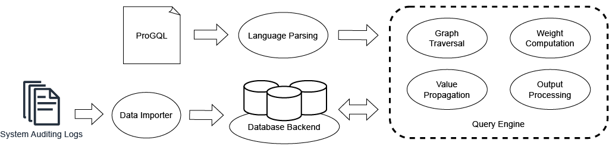

### 🔭 I’m currently working on README...
## Introduction

Provenance analysis (PA) has recently emerged as an important solution for cyber attack investigation.
PA leverages system monitoring to monitor system activities as a series of system audit events and organizes these events as a *provenance graph* to show the dependencies among system activities, which can reveal steps of cyber attacks. 
However, existing PA techniques *are not extensible* and cannot easily incorporate expert knowledge to customize the output provenance graph.
Moreover, most of these techniques load all the event data into memory and thus *are not scalable* (requiring $>100GB$ memory). 
To address these fundamental limitations, we propose the ProGQL framework, which provides (1) a novel domain-specific graph search language to let security experts customize PA and manipulate the output graph, and (2) a novel query engine that optimizes the execution of a ProGQL query over a colossal amount of system audit events. 
In particular, our ProGQL framework employs a database backend that can be formed by a single type of database or a mixed type of databases, and performs incremental graph search to minimize memory consumption. 

Our ProGQL framework consists of 3 major modules, as shown above.
1. The data importer module takes system auditing logs as input, and performs batch insertion into the database backend. 
2. The language parsing module takes a ProGQL query as input, parses the query text, and extracts the query context that contains all the required information for query execution.
3. The query engine is the core module of the ProGQL system, which executes the ProGQL query based on the extracted query context and searches the system auditing logs stored in the database backend to generate the desired provenance graph. 
The query engine consists of four components:
- The graph traversal component finds the POI record in the database backend and performs graph search based on the query context.
In particular, incremental graph search is adopted to optimize the memory footprint and minimize search scope.
- The weight computation component applies the weight computation function defined in the query context for each edge.
- The value propagation component propagates the values defined in the query context for each node.
- The output processing component performs union or intersection of the graphs defined in the query context and outputs the processed graph as the provenance graph.

## Requirements

JAVA Version: 1.8

Databases:
- PostgresSQL 9.5.25 with username:postgres and password:12345678
- Neo4j 3.5.11
- Nebula 3.3.0 with username:root and password:root
- MariaDB 10.4.19 with username:root and passwod:12345678
- Myrocks (Facebook MySQL 5.6.35) with username:root and no password

## Usage
