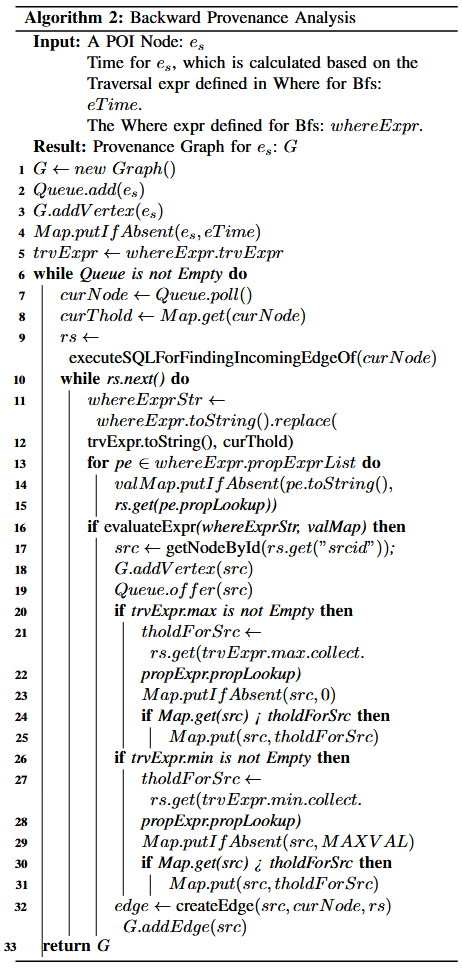

## Backward BFS in PA

Algorithm 2 shows an example of constructing a PG by performing a backward BFS tracking, initiating from a given POI node and its threshold value. The threshold value is determined as the maximum or minimum of the start time/end time for its incoming or outgoing events, which is defined in the traversal expression. When the algorithm visits a node, it first gets its all incoming edges, then it filters out eligible incoming edges based on the search constraints defined in the where expression. Line 11 to 16 illustrate the evaluation process for the where expression. As shown in Algorithm 1, the property expressions and traversal expression are parsed and assigned as variables of the where expression. During the traversal, they are substituted with actual values and transmitted to the evaluateExpr function. The evaluateExpr function is built upon the Javaluator to support dynamic evaluation in scenarios where the expressions may change at runtime. It also supports arithmetic and logical operations. Once the eligible incoming edges are chosen, they, along with their respective source nodes, are added into the graph G. Subsequently, the threshold values for the associated source nodes are updated.

