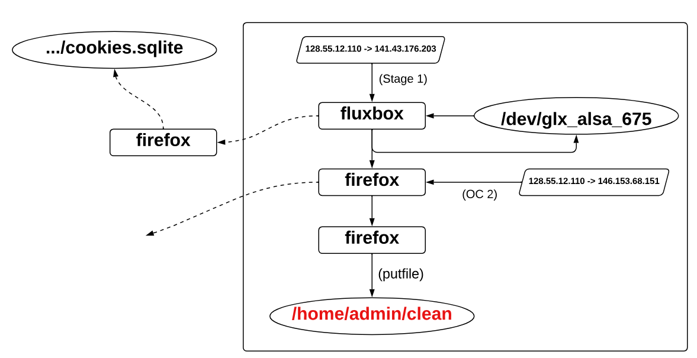
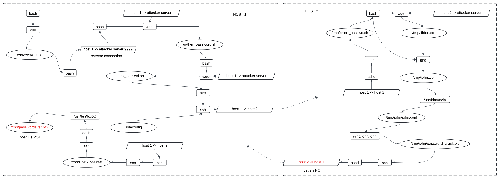

## Case Study of PGs for Attack Cases

The following figures show the critical components for both attacks.
Solid lines indicate critical edges, while dashed lines represent non-critical edges. The POI events are clearly highlighted in red.

- The above figure shows the PG generated by ProGQL for the “Theia Case 1” attack in the DARPA dataset. In this graph, we can see that the victim browses 141.43.176.203 (stage1 server) using Firefox, which results in the drakon implant running in memory in the Firefox process with a connection out to the attacker operator console (146.153.68.151). Attacker now has a shell inside Firefox, from inside Firefox, attacker calls putfile to write /home/admin/clean to disk. ProGQL successfully identifies the IP address as the attack entry, preserving all critical edges for analysis.

- The above figure shows the PG generated by ProGQL for the “Password Crack” attack. By exploiting the Shellshock vulnerability, the attacker is able to gain initial access to host1. Upon successful compromise, the attacker establishes a reverse shell connection to remotely control host1. Once in control of host1, the attacker downloads and executs a malicious script gather_password.sh. This script identifies victim hosts (i.e., host2) and downloads another malicious script crack_passwd.sh, transfers it to host2 and executs it. crack_passwd.sh then downloads a series of files, including a malicious payload libfoo.so from the attack server. libfoo.so cracks passwords on the victim host. The resulting password_crack.txt file contains plaintext passwords, which is then transferred to host1 and compressed as the /tmp/passwords.tar.bz2. This file serves as a consolidated package of sensitive information, ready for exfiltration.

Both cases demonstrate that ProGQL is highly effective in expressing PA that can reveal the attack steps in the produced PGs.

