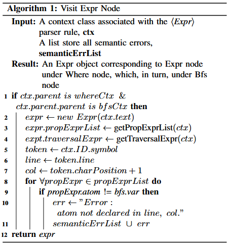

## Language Parsing

The engine utilizes Antlr to parse the language. Antlr is a powerful and widely-used tool for building languages and language processors. It can automatically generate a parse tree which reflects the structure of the input based on the grammar rules. It also supports the Visitor and Listener patterns, allowing to define operations on the parse tree nodes easily. Using the Visitor pattern, ProGQL extends the base visitor class where the traversal logic is encapsulated, and overrides the visitor methods defined in the base visitor to build its model objects corresponding to different types of nodes in the parse tree. ProGQL also performs specific actions to handle semantic errors in the language when invokes a visitor method. 

Algorithm 1 builds an Expr model object corresponding to ⟨Expr⟩ parser rule by overriding the base visitor method visitExpr(ctx). The ctx parameter is a context object associated with the corresponding parser rule. It contains information about the parse tree node for that specific rule, including any child nodes and their relationships. Based on our grammar, an expression is composed of comparison expressions connected by logical operators, which, in turn, are constructed from property expressions. Therefore, We define propExprList as a variable of an Expr object, which sequentially stores all property expressions (excluding those within a traversal expression) present in the overall expression. The function getPropExprList(ctx) (Line 3) recursively explores a parse tree rooted at the given ctx, and adds found PropExpr objects to propExprList. Similarly, getTraversalExpr(ctx) (Line 4) focuses on finding TraversalExpr object. The if condition in Line 1 specifies that the algorithm identifies and returns an Expr object located under a Where node, which, in		turn, is under a Bfs node. Line 6 to 11 handle the semantic errors. If the atom name of a PropExpr object doesn’t match the variable name declared in a Bfs object, it is considered as a semantic error and is added to a global semantic error list, which can be checked externally to determine if any semantic errors occurred.

Besides handling the semantic errors, ProGQL also hanles the syntax errors by extending the base error listener class and overrides syntaxError method to catch syntax errors during parsing.

